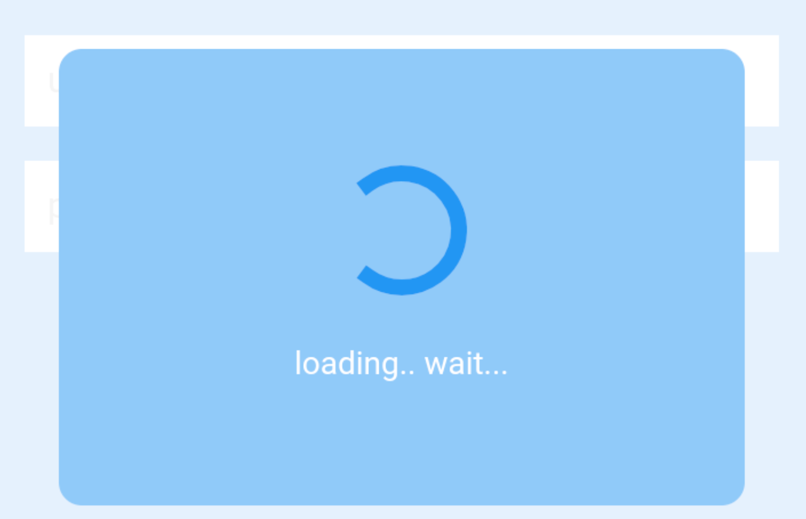

I suppose how to handle **progress indicator** while async request in App isn't too often discussed, although it's such a significant topic which most frontend app devs would face.



A progress indicator or spinner plays two roles in general. One is to block another interaction by user while processing a job taking long time. The other is letting the user know that the job is correctly in progress and the App isn't hanging up.

In React, we could come up with some ways to handle the appearance of an indicator.

## 1. 🙅‍♂️ With state in redux (updated by each action, a spinner per a screen)

```js
// reducer
const userState = {
    users: [],
    showSpinner: false,
};
const userReducer = (state, action) => {
  switch (action.type) {
    case 'FETCH_USER':
        return { ...state, showSpinner: true };
    case 'FETCH_USER_SUCCESS':
        return { ...state, users: action.payload.users, showSpinner: false };
    case 'FETCH_USER_FAILURE':
        return { ...state, showSpinner: false };
  }
};

// dispatch
const fetchUserEffect = async (dispatch) => {
    const users = await fetchUsers();
    dispatch(fetchUserSuccess(user));
};

// container
const MainScreen = ({ showSpinner }) => (
    <MainScreen>
        <>
        <UserList>
        {showSpinner && <Spinner />}
        </>
    </MainScreen>
);
```

This seems to work well if we see it in a tutorial page or something. However, there are a lot of pitfalls in fact and they easily end in fail in actual production.

First, spinner's visibility is tied to a specific another task. Apparently, this isn't nice from a reusability perspective, for example. What if we have got to call `fetchUsers()` **without a spinner** in another case?

And then, the <Spinner /> component is located at each screen component level here. In case the spinner component is on modal and covers the entire screen, it often conflicts with another component (like modal and alert) and sometimes behaves in an unexpected manner. Moreover, the App can't move to the next screen while async call because of this.

So, now we try separating `showSpinner()` and `hideSpinner()` as independent actions from these async calls. In addition to that, decide not to put a spinner in each component but use a common spinner at the `<App />` level.

## ‍2. 🙅‍♂️ With state in redux (updated by specific actions, one spinner in the entire app)

```js
// reducer
const userState = {
    users: [],
    showSpinner: false,
};
const spinnerReducer = (state, action) => {
  switch (action.type) {
    case 'SHOW_SPINNER':
        return { ...state, showSpinner: true };
    case 'HIDE_SPINNER':
        return { ...state, showSpinner: false };
  }
};

// dispatch
const fetchUserEffect = async (dispatch) => {
    dispatch(showSpinner());
    const users = await fetchUsers();
    dispatch(setUser(user));
    dispatch(hideSpinner());
};

// container
const App = ({ showSpinner }) => (
    <App>
        <>
        <MainScreen>
        {showSpinner && <Spinner />}
        </>
    </App>
);
```

Now the code in `fetchUserEffect` got way more imperative 😨 I cannot help worring about forgetting to add `showSpinner` `hideSpinner` action and arbitary changes between the two actions in the future.

Then, suppose that we newly have got to call `fetchFavorite()` with `users` by the result of `fetchUsers()` via redux store. 

The new code is like:

```js
const fetchUserEffect = async (dispatch) => {
    dispatch(showSpinner());
    const users = await fetchUsers();
    dispatch(fetchUserSuccess(users));
};

// whenever we successfully get users, we fetch their favorites
const fetchUserSuccessEffect = async (dispatch) => {
    dispatch(fetchFavorite());
    dispatch(hideSpinner());
};

// fetchFavorite() works independently with redux store
const fetchFavoriteEffect = async (dispatch, store) => {
    dispatch(showSpinner());
    const users = getUsers(store)
    const favorites = await fetchFavorites(users);
    dispatch(fetchFavoriteSuccess(favorite));
};

const fetchFavoriteSuccessEffect = async (dispatch) => {
    dispatch(hideSpinner());
};
```

Now this got so verbose due to tons of `showSpinner()` `hideSpinner()` 😂 It doesn't look nice. To make matters worse, the spinner would appear and disappear during `fetchFavorite()` since it also does async call. They would end up a awkward flickering of the spinner between calls.

For a long time, I'd have been not sure how to solve these issues at the same time..., but found a great library to solve the most problems!

## 3. 🙆‍♂️ With `react-promise-tracker`

[react-promise-tracker](https://github.com/Lemoncode/react-promise-tracker)
https://github.com/Lemoncode/react-promise-tracker

This is a simple promise tracker. The syntax is like:

```js
import { trackPromise } from 'react-promise-tracker';

trackPromise(
    fetchUsers(); // You function that returns a promise
);
```

```js
import React, { Component } from 'react';
import { usePromiseTracker } from "react-promise-tracker";

export const App = () => {
    const { promiseInProgress } = usePromiseTracker();
    return (
        <App>
            <>
            <MainScreen>
            {promiseInProgress && <Spinner />}
            </>
        </App>
    )
};
```

I found it much simpler by just watching `Promise`. We can manage multiple state of spinners by defining `area` in props. And it supports `delay` option to avoid flickering.

```js
const { promiseInProgress } = usePromiseTracker({area: 'big-spinner', delay: 500});

trackPromise(
    fetchUsers(),
    {area: 'big-spinner'}
);
```

But it's still hard to handle spinner appearance on making multiple async calls properly. In that case, I suppose we need a custom function binding multiple promises or a help from another library.

It'll be great if you let me know your idea, a better solution or whatever. Thanks!
