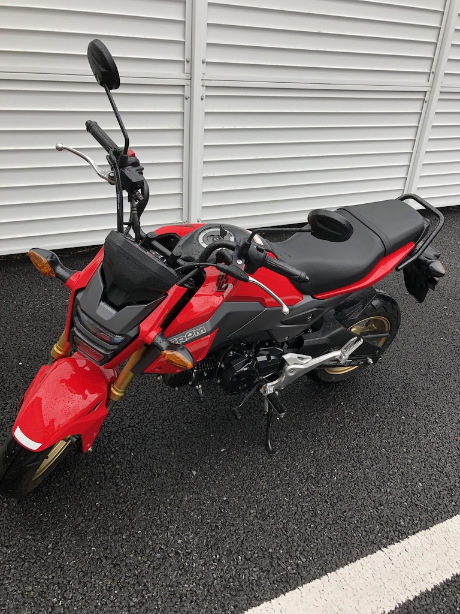

趣味で時々、レンタルの小型バイクに乗ってます。

レンタルバイクって言うとなんか自転車みたいだけど、バイクとかスクーターの意味のバイクです！

短距離で乗るのが気分転換になります。ビッグスクーターとかハーレーみたいな大型バイクよりも、小型のほうが経済的で取り回しが楽なので好みなんですよね。街乗りだと、125ccでも力不足に感じることはほとんど無い感じです。

こちら最近乗ったバイクの写真です。毎回違うバイクを試してみてます。

#### GROM

#### HONDA monkey

#### pcx

24時間のレンタルって1万円以上かかることが多いんですが、年間契約だとだいぶ安くなります。24時間レンタルが1年で10回できて、初期費用1万円+月額3500円（+乗車ごとに保険料）って感じですね。

グルメ+温泉+ツーリング+きれいな景色って、くたびれた現代人にとっての最強ムーブの1つだとおもいます！満腹になって温泉であったまった後に、冷たい風を感じて走るのは本当気持ち良いです。おすすめ 😎
