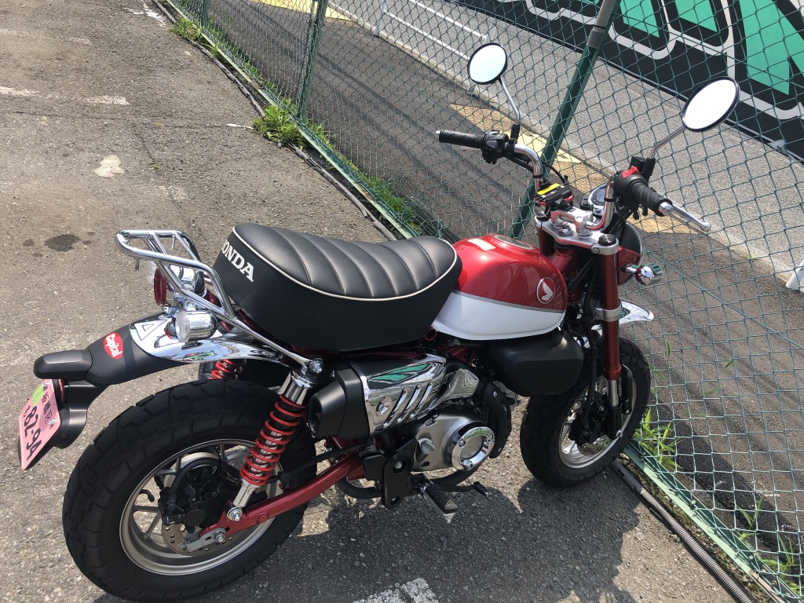

I often rent a pocket bike just for fun.

It's called Rental Bike in Japan because 'bike' (バイク) stands for 'motercycle' in Japanese. It's a bit confusing 😖

Anyway, short-distance motercycle touring is a change of pace for me. I love smaller ones rather than big scooters or harley davidsons for their cost-efficiency and easy handling in a city. In most cases, nowadays, 125cc seems to be enough powerful for casual riding.

These are pictures of a motercycle that I recently rode. I try another model whenever I ride.

#### GROM

#### HONDA monkey

#### pcx

24h rental usually costs more than 100$. But yearly-subscription service for that is much cheaper. 24h * 10 times rental in a year only costs initial 100$ and monthly 35$ (plus, charge for insurance for each ride).

Gourmet + Onsen + Ride + Beautiful Places combo is the best practice to refresh for every office worker. Riding in a nice breeze is super confortable after getting warm up. I highly recommend it 😎
