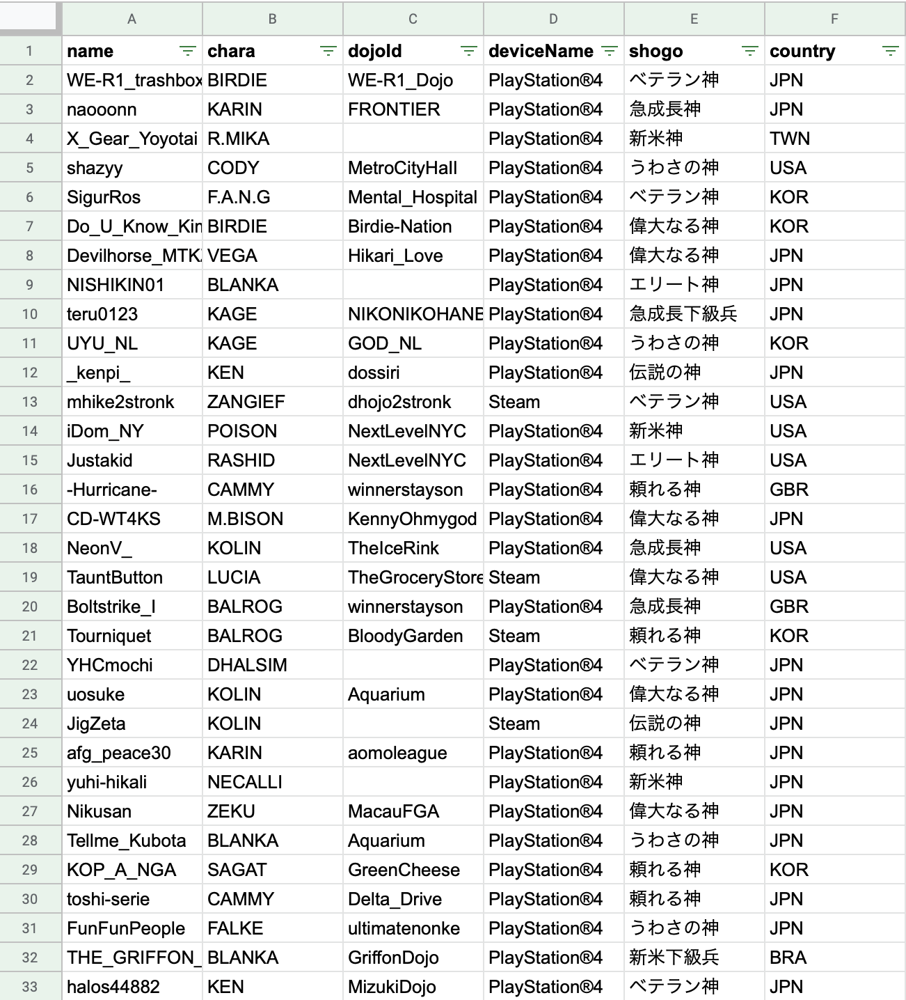

というわけで、勝手に調べちゃいました。特に断りの無い場合、CFNランキング上位約10,000人を対象に、シャド研から参照可能な自己申告のプレイヤー情報をもとにしています。手作業多めなので、ミスがあったらごめんなさい。。

part1は[こちら](https://blog.oisulab.com/state-of-sfv-cfn-ranking-2019/)。

※2020/1/2 〜 2020/1/4時点

※データを3日間に分散させて取得したため、人によっては2020/1/2時点の情報だったり、2020/1/4時点の情報だったりしていますが、集計結果にはあまり影響しないものと思います

## リーグごとの分布

上からの割合は、LP0のプレイヤー順位（rank 1123714）をもとに、全体のプレイヤー数を1,123,714人として算出しています。アクティブにプレイしているユーザー数ではなく、単純なアカウント数が母数なので、あくまで目安程度です。

|リーグ|人数|上からの割合|
|---|:---:|:---:|
|Warlord|49|0.004%
|UltimateGrandMaster|377|0.03%
|GrandMaster|1542|0.17%
|Master|1457|0.3%
|UltraDiamond|2771|0.55%
|SuperDiamond|3755|0.88%
|全体|1,123,714|100%

LPの平均・中央値・標準偏差です。端数切捨て。

|リーグ|平均|中央値|標準偏差|
|---|:---:|:---:|:---:|:---:|
|Warload|388898|347336|109369
|UltimateGrandMaster|152427|135415|298
|GrandMaster|46671|40390|294
|Master|30981|30406|297
|UltraDiamond|26372|30403|297
|SuperDiamond|22370|22115|268
|全体|35151|25550|37675

上位10,000人のLP分布はこういう感じになりました。

## 国ごとの分布

国別のプレイヤー分布です。

|国|割合|
|---|:---:|
|日本|35.08%|
|アメリカ|17.79%|
|不明|9.36%|
|ブラジル|8.32%|
|韓国|4.09%|
|中国|3.45%|
|フランス|2.21%|
|英国|2.11%|
|メキシコ|1.75%|
|カナダ|1.65%|
|ドミニカ共和国|1.1%|
|台湾|1.03%|
|チリ|0.98%|
|ドイツ|0.69%|
|イタリア|0.64%|
|オーストラリア|0.59%|
|スペイン|0.47%|
|アルゼンチン|0.44%|
|ペルー|0.44%|
|フィリピン|0.39%|
|タイ|0.34%|
|(その他)|0.93%|

アメリカの次に多いのがブラジルということで、少し意外でした。メキシコやドミニカなど、南米勢は多いです。

## PS4/PC

|Platform|割合|
|---|:---:|
|PS4|68.68%|
|PC (Steam)|31.32%|

7割近くがPS4です。

## 非アクティブユーザー

|リーグ|未ログイン 180日以上|割合|未ログイン 30日以上|割合|
|---|:---:|:---:|:---:|:---:|
|Warlord|0人|0%|0人|0%
|UltimateGrandMaster|4人|1.07%|21人|5.58%
|GrandMaster|136人|8.82%|339人|21.99%
|Master|133人|9.13%|395人|27.12%
|UltraDiamond|365人|13.18%|854人|30.82%
|SuperDiamond|578人|15.4%|1187人|31.62%

アルマスまでやりこんで半年以上プレイしていないプレイヤーはたった4人、うち1つはウメハラさんの旧アカウント（memememe）でした。ウォーロードともなると、全員1ヶ月以内にログインしています。

疲れてしまったので、いったんここまでで、もしやる気が出ればまた他のデータも出してみたいと思います...。
