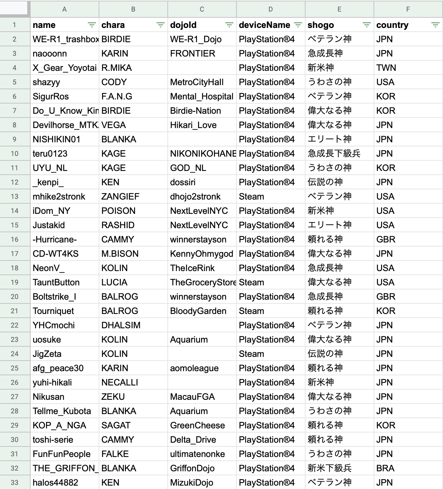
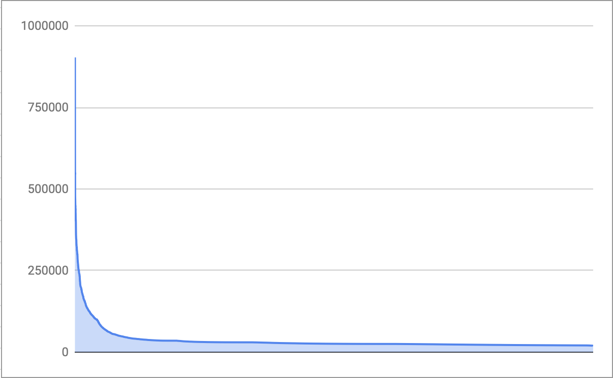

So I investigated as I like. If there's no note, data are based on top about 10,000 players in CFN ranking which we can see on the CFN website. Keep in mind that I'm not 100% sure there's no mistakes because I partially aggregated by hand!

part1 is [here](https://blog.oisulab.com/state-of-sfv-cfn-ranking-2019/).

* As of 2020/1/2 ~ 2020/1/4

* I fetched data through 3days. So base date of data is a bit different among players. But I think it doesn't affect the results so much.

## League

% of top is calculated assuming the number of players is 1,123,714 (coming from LP0 player's rank). Note that it doesn't mean the number of active players but just accounts.

|league|num|% of top|
|---|:---:|:---:|
|Warlord|49|0.004%
|UltimateGrandMaster|377|0.03%
|GrandMaster|1542|0.17%
|Master|1457|0.3%
|UltraDiamond|2771|0.55%
|SuperDiamond|3755|0.88%
|All|1,123,714|100%

average, mean, SD (rounded up).

|league|average|mean|SD|
|---|:---:|:---:|:---:|:---:|
|Warload|388898|347336|109369
|UltimateGrandMaster|152427|135415|298
|GrandMaster|46671|40390|294
|Master|30981|30406|297
|UltraDiamond|26372|30403|297
|SuperDiamond|22370|22115|268
|All|35151|25550|37675

Distribution of top 10,000 players is like this:

## Country

Player's country info.

|country|%|
|---|:---:|
|Japan|35.08%|
|US|17.79%|
|unknown|9.36%|
|Brazil|8.32%|
|Korea|4.09%|
|China|3.45%|
|France|2.21%|
|UK|2.11%|
|Mexico|1.75%|
|Canada|1.65%|
|Dominican Republic|1.1%|
|Taiwan|1.03%|
|Chile|0.98%|
|Germany|0.69%|
|Italy|0.64%|
|Australia|0.59%|
|Spain|0.47%|
|Argentina|0.44%|
|Peru|0.44%|
|Philippines|0.39%|
|Thailand|0.34%|
|(Others)|0.93%|

It's a little bit unexpected to me that the number of Brazilian players is the second biggest. There are a lot of players from South America.

## PS4/PC

|Platform|%|
|---|:---:|
|PS4|68.68%|
|PC (Steam)|31.32%|

Nearly 70% is PS4.

## Inactive User

|league|no login for 180 days|%|no login for 30 days|%|
|---|:---:|:---:|:---:|:---:|
|Warlord|0|0%|0|0%
|UltimateGrandMaster|4|1.07%|21|5.58%
|GrandMaster|136|8.82%|339|21.99%
|Master|133|9.13%|395|27.12%
|UltraDiamond|365|13.18%|854|30.82%
|SuperDiamond|578|15.4%|1187|31.62%

Only 4 UGM players who don't login for half a year, which includes Daigo's one (memememe). All warlords logged in within a month as expected.

I finished the work at this point because I'm so tired.
If I got motivated, I perhaps do this further...
