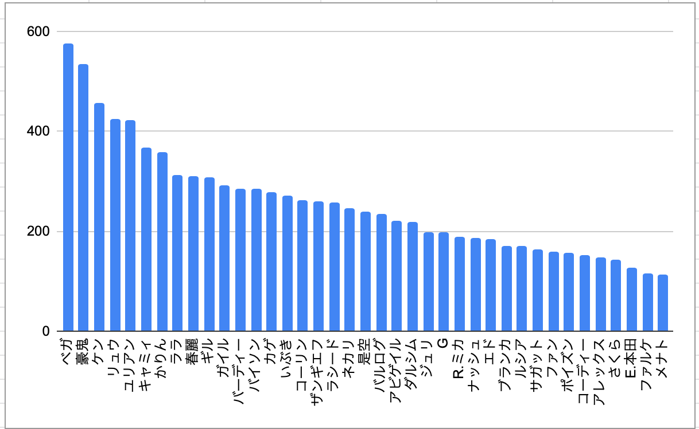

こちらはランキング1位、trashboxさんのプロフィールページ。

2019年も残りわずかということで、スト5のCFNランキングをもとにして、いろいろ統計を取ってみています。手始めに上位10,000人の使用キャラクターを調べてみました。なかなか意外なデータも見えてきて面白い！

まずはランキング上位100人の使用キャラクターです。

## キャラクター別人数 (上位100人)

ちなみに100位の方のLPは215,402で、アルマス2回分。猛者中の猛者に限定したキャラクター分布です。

調整直後ということで、新キャラやサブキャラをお試し中の人も多いと思われますが、意外にダルシムとファンが多いですね。

|キャラ| Character|人数|
|---|:---:|:---:|
|かりん|KARIN|9|
|ベガ|M.BISON|6|
|キャミィ|CAMMY|6|
|ダルシム|DHALSIM|5|
|ファン|F.A.N.G|5|
|バイソン|BALROG|5|
|コーリン|KOLIN|5|
|バーディー|BIRDIE|4|
|ユリアン|URIEN|4|
|豪鬼|AKUMA|4|
|ルシア|LUCIA|4|
|ケン|KEN|3|
|バルログ|VEGA|3|
|ザンギエフ|ZANGIEF|3|
|ララ|LAURA|3|
|是空|ZEKU|3|
|コーディー|CODY|3|
|リュウ|RYU|2|
|春麗|CHUN-LI|2|
|R.ミカ|R.MIKA|2|
|ラシード|RASHID|2|
|ブランカ|BLANKA|2|
|カゲ|KAGE|2|
|E.本田|E.HONDA|2|
|ギル|GILL|2|
|ナッシュ|NASH|1|
|ネカリ|NECALLI|1|
|ガイル|GUILE|1|
|いぶき|IBUKI|1|
|ジュリ|JURI|1|
|アビゲイル|ABIGAIL|1|
|メナト|MENAT|1|
|G|G|1|
|サガット|SAGAT|1|
|アレックス|ALEX|0|
|エド|ED|0|
|さくら|SAKURA|0|
|ファルケ|FALKE|0|
|ポイズン|POISON|0|

## キャラクター別人数 (上位10,000人)

次は上位10,000人のランキングです。こちらはおおむね、今年の活躍度合いに沿った使用人数になっているような印象です。リュウ・ケン・キャミィ・春麗は、キャラ人気からか、やはり多いですね！
ちなみに9999位（同率で2人）の方のLPは20,505。上位10,000人でスパダイ以上の分布といった感じです。

|キャラ| Character|人数|
|---|:---:|:---:|
|ベガ|M.BISON|577|
|豪鬼|AKUMA|535|
|ケン|KEN|458|
|リュウ|RYU|425|
|ユリアン|URIEN|423|
|キャミィ|CAMMY|367|
|かりん|KARIN|359|
|ララ|LAURA|312|
|春麗|CHUN-LI|311|
|ギル|GILL|308|
|ガイル|GUILE|291|
|バーディー|BIRDIE|285|
|バイソン|BALROG|285|
|カゲ|KAGE|278|
|いぶき|IBUKI|272|
|コーリン|KOLIN|262|
|ザンギエフ|ZANGIEF|261|
|ラシード|RASHID|258|
|ネカリ|NECALLI|247|
|是空|ZEKU|239|
|バルログ|VEGA|234|
|アビゲイル|ABIGAIL|221|
|ダルシム|DHALSIM|219|
|ジュリ|JURI|198|
|G|G|198|
|R.ミカ|R.MIKA|190|
|ナッシュ|NASH|186|
|エド|ED|185|
|ブランカ|BLANKA|170|
|ルシア|LUCIA|170|
|サガット|SAGAT|163|
|ファン|F.A.N.G|160|
|ポイズン|POISON|156|
|コーディー|CODY|152|
|アレックス|ALEX|147|
|さくら|SAKURA|142|
|E.本田|E.HONDA|127|
|ファルケ|FALKE|116|
|メナト|MENAT|113|

グラフにするとこんな感じになりました。

次は個別のプロフィールページの情報をあつめて、地域別のキャラ分布や、勝率・対戦数などを含めたデータを取ってみたいと思っています。

自分が使用キャラで世界何位ぐらいなのか、国内では何位なのか、同ランク帯と比較して試合数と勝率は高いほうなのか低いほうなのか、とかをざっくり知ることで、ランクマを続けるモチベや来年の目標設定に繋がるかなと思い...。乞うご期待ください！
